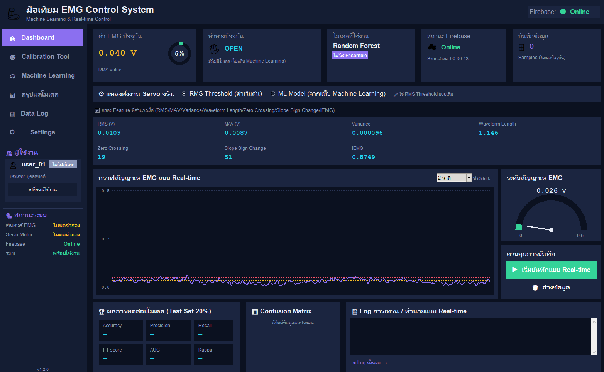
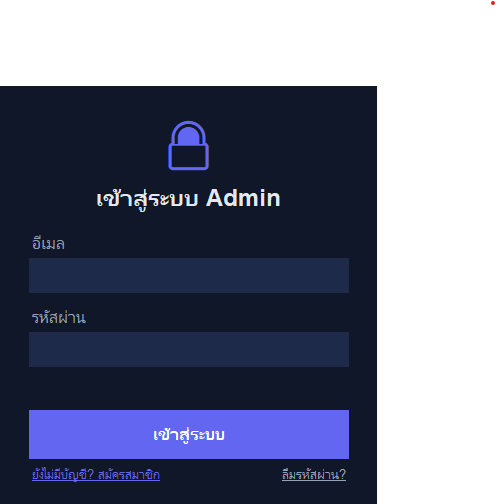
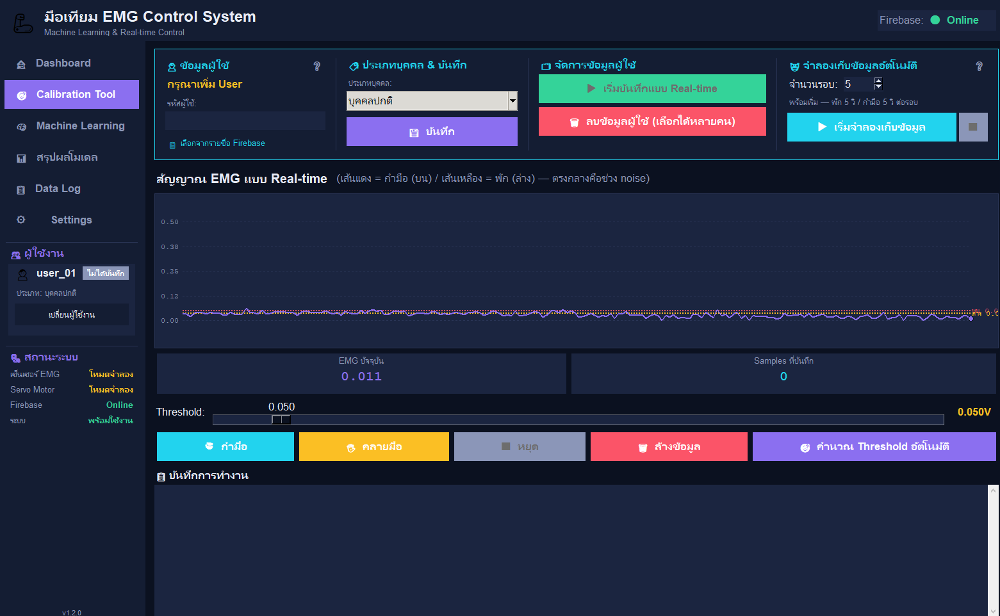
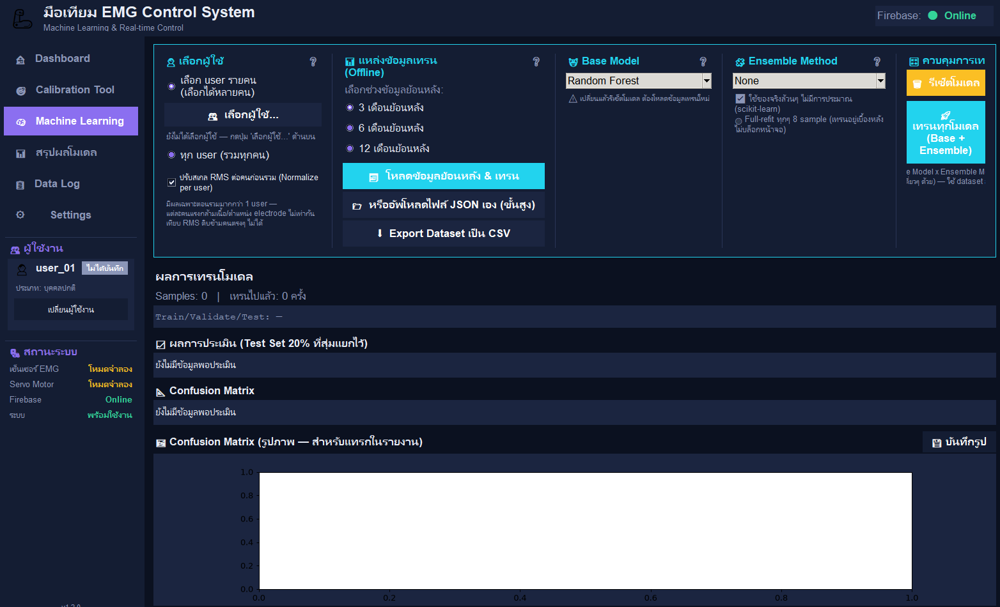
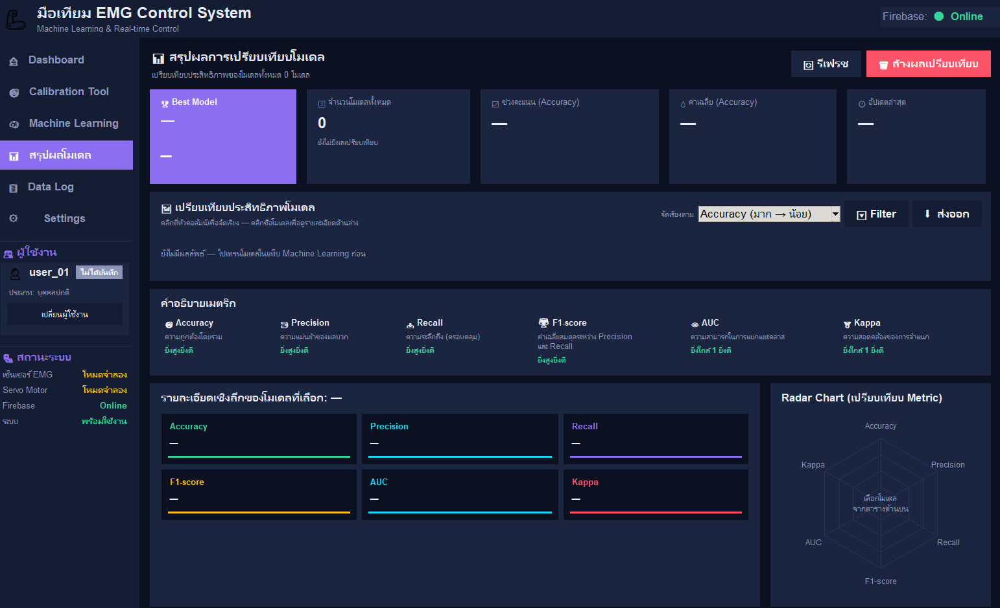
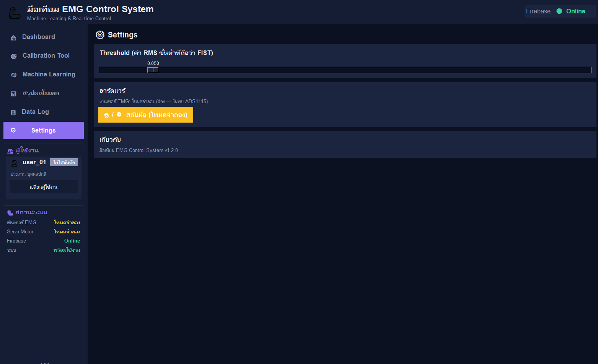

# มือเทียม EMG Control System

โปรแกรม GUI สำหรับควบคุมมือเทียมด้วยสัญญาณไฟฟ้ากล้ามเนื้อ (EMG) แบบ Real-time พร้อมโมดูล Machine Learning สำหรับจำแนกท่าทางมือ (กำมือ / คลายมือ) พัฒนาด้วย Python (Tkinter + matplotlib) รันบน Raspberry Pi 5 เชื่อมต่อฐานข้อมูล Firebase สำหรับระบบสมาชิกและจัดเก็บข้อมูล



**เวอร์ชันปัจจุบัน:** v1.2.0

> หมายเหตุ: ภาพหน้าจอทั้งหมดในคู่มือนี้ถ่ายจาก **โหมดจำลอง (Simulation/Dev Mode)** ก่อนที่จะมีการเทรนโมเดลหรือบันทึกข้อมูลจริง ค่าตัวเลขหลายจุดจึงยังเป็น `0` หรือ `—` (ยังไม่มีข้อมูล) — พอใช้งานจริงแล้วค่าเหล่านี้จะเปลี่ยนไปตามข้อมูลที่มี

---

## สารบัญ

- [ภาพรวมระบบ](#ภาพรวมระบบ)
- [การติดตั้ง](#การติดตั้ง)
- [องค์ประกอบที่ใช้ร่วมกันทุกหน้า](#องค์ประกอบที่ใช้ร่วมกันทุกหน้า)
- [การเข้าสู่ระบบ (Login)](#การเข้าสู่ระบบ-login)
- [หน้า Dashboard](#หน้า-dashboard)
- [หน้า Calibration Tool](#หน้า-calibration-tool)
- [หน้า Machine Learning](#หน้า-machine-learning)
- [หน้า สรุปผลโมเดล](#หน้า-สรุปผลโมเดล)
- [หน้า Data Log](#หน้า-data-log)
- [หน้า Settings](#หน้า-settings)
- [การตั้งค่าผู้ดูแลระบบครั้งแรก (setup_admin.py)](#การตั้งค่าผู้ดูแลระบบครั้งแรก-setup_adminpy)
- [โครงสร้างไฟล์ในโปรเจกต์](#โครงสร้างไฟล์ในโปรเจกต์)

---

## ภาพรวมระบบ

โปรแกรมประกอบด้วยเมนูด้านซ้าย (sidebar) แบ่งเป็น 6 หน้าหลัก ได้แก่ Dashboard, Calibration Tool, Machine Learning, สรุปผลโมเดล, Data Log และ Settings โดยแต่ละหน้าทำหน้าที่ต่างกันดังนี้

- **Dashboard** — หน้าหลักสำหรับดูค่าสัญญาณ EMG แบบ Real-time และควบคุมการทำงานของมือเทียม
- **Calibration Tool** — หน้าสำหรับเก็บข้อมูลผู้ใช้งานใหม่และปรับตั้งค่า Threshold
- **Machine Learning** — หน้าสำหรับเทรนโมเดลจำแนกท่าทางจากข้อมูลที่เก็บไว้
- **สรุปผลโมเดล** — หน้าเปรียบเทียบประสิทธิภาพของโมเดลที่เทรนไปแล้วทั้งหมด
- **Data Log** — หน้าแสดงประวัติการทำงานของระบบทั้งหมดแบบ real-time
- **Settings** — หน้าตั้งค่า Threshold และตรวจสอบสถานะฮาร์ดแวร์

ระบบรองรับการทำงาน 2 โหมด คือ **โหมดฮาร์ดแวร์จริง** (เซนเซอร์ ADS1115 + เซอร์โว PCA9685) และ **โหมดจำลอง (Simulation/Dev Mode)** สำหรับพัฒนาและทดสอบโดยไม่ต้องต่อฮาร์ดแวร์จริง — หน้าจอในคู่มือนี้ถ่ายจากโหมดจำลอง

---

## การติดตั้ง

### สิ่งที่ต้องมีก่อน

- Python 3.9 ขึ้นไป
- **Tkinter** — มากับ Python บน Windows/Mac อยู่แล้ว แต่บน Linux/Raspberry Pi OS ต้องติดตั้งแยกด้วย:
  ```bash
  sudo apt update && sudo apt install python3-tk
  ```
- บัญชี [Firebase](https://console.firebase.google.com/) (ใช้ฟรีได้) สำหรับ Authentication + Realtime Database
- (เฉพาะรันบนฮาร์ดแวร์จริง) Raspberry Pi 5 ที่ต่อเซนเซอร์ ADS1115 (อ่านสัญญาณ EMG) และ PCA9685 (ควบคุม Servo) — ถ้าไม่มีฮาร์ดแวร์ โปรแกรมจะสลับไปโหมดจำลองให้อัตโนมัติ ใช้พัฒนา/ทดสอบบน PC ทั่วไปได้เลย

### 1. ติดตั้งไลบรารี Python

```bash
pip install -r requirements.txt --break-system-packages
```

ถ้าต้องรันบนฮาร์ดแวร์จริง (Raspberry Pi ที่ต่อ ADS1115/PCA9685) ให้ติดตั้งเพิ่มอีกชุด:

```bash
pip install -r requirements-raspberrypi.txt --break-system-packages
```

ไลบรารีเสริม (ไม่ติดตั้งก็ใช้งานได้ปกติ — แค่จะไม่มีตัวเลือกโมเดล XGBoost/CatBoost ในหน้า Machine Learning):

```bash
pip install xgboost catboost --break-system-packages
```

### 2. ตั้งค่า Firebase

1. สร้างโปรเจกต์ใหม่ใน [Firebase Console](https://console.firebase.google.com/)
2. ไปที่ **Authentication → Sign-in method** แล้วเปิดใช้งาน **Email/Password**
3. ไปที่ **Realtime Database** แล้วสร้างฐานข้อมูล (เลือกโหมด test ไปก่อนได้ระหว่างพัฒนา แล้วค่อยตั้ง Rules ให้รัดกุมขึ้นก่อนใช้งานจริง)
4. ไปที่ **Project settings → General → Your apps** สร้างแอปแบบ Web (ไอคอน `</>`) แล้วคัดลอกค่า config ที่ได้
5. คัดลอกไฟล์ตัวอย่าง แล้วใส่ค่าจริงที่ได้จากข้อ 4 ลงไป:
   ```bash
   cp firebase_config.example.py firebase_config.py
   ```
   จากนั้นแก้ค่าใน `firebase_config.py` ให้ตรงกับโปรเจกต์ของตัวเอง

   > ⚠️ ไฟล์ `firebase_config.py` มีค่า config จริงของโปรเจกต์ — ถูกใส่ไว้ใน `.gitignore` แล้ว **ห้าม commit ขึ้น Git repo สาธารณะ** ถ้าจะแชร์ repo ต่อ ให้เช็คด้วยว่า Realtime Database Rules ไม่ได้เปิด read/write แบบสาธารณะ (`true`) ค้างไว้จากตอนพัฒนา

6. ทดสอบว่าตั้งค่าถูกต้องด้วย:
   ```bash
   python3 test_firebase_connection.py
   ```

### 3. สร้างบัญชีผู้ดูแลระบบคนแรก

```bash
python3 setup_admin.py
```

ดูรายละเอียดขั้นตอนใน [การตั้งค่าผู้ดูแลระบบครั้งแรก (setup_admin.py)](#การตั้งค่าผู้ดูแลระบบครั้งแรก-setup_adminpy)

### 4. รันโปรแกรม

```bash
python3 prosthetic_gui.py
```

---

## องค์ประกอบที่ใช้ร่วมกันทุกหน้า

หน้าจอทุกหน้า (ยกเว้นหน้า Login ซึ่งเป็นหน้าต่างแยกต่างหาก) มีโครงสร้างเดียวกัน 2 ส่วนนี้เสมอ — อธิบายรวมไว้ที่นี่ที่เดียว จะไม่พูดซ้ำในแต่ละหน้าด้านล่าง

**ส่วนหัว (บนสุด)**

- มุมซ้ายบน: ไอคอนรูปมือ + ชื่อโปรแกรม **"มือเทียม EMG Control System"** (ตัวหนา สีขาว) และใต้ชื่อเป็นคำบรรยายเล็กๆ สีเทา **"Machine Learning & Real-time Control"**
- มุมขวาบน: ป้ายสถานะ **"Firebase: 🟢 Online"** (จุดวงกลมสีเขียว = เชื่อมต่อ Firebase ได้ปกติ — ถ้าหลุดจะเปลี่ยนเป็นสีอื่นและข้อความอื่น)

**แถบเมนูด้านซ้าย (Sidebar)**

- **รายการเมนู 6 หน้า** เรียงจากบนลงล่าง พร้อมไอคอนกำกับ: 🏠 Dashboard, 🎯 Calibration Tool, 🧠 Machine Learning, 📊 สรุปผลโมเดล, 📋 Data Log, ⚙️ Settings — หน้าที่กำลังเปิดอยู่จะถูกไฮไลต์พื้นหลังสีม่วง (violet)
- **หัวข้อ "👤 ผู้ใช้งาน"** ตามด้วยการ์ดผู้ใช้ปัจจุบัน:
  - ไอคอนคนตัวเล็ก + รหัสผู้ใช้ปัจจุบันตัวหนา (ตัวอย่าง `user_01`)
  - ป้ายเล็กสีเทาข้างชื่อ: **"ไม่ได้บันทึก"** (แจ้งว่า user คนนี้ยังไม่มีข้อมูล calibration ที่บันทึกไว้)
  - บรรทัดถัดมา: **"ประเภท: บุคคลปกติ"** (ประเภทบุคคลของผู้ใช้ที่เลือกอยู่)
  - ปุ่มเต็มความกว้าง **"เปลี่ยนผู้ใช้งาน"** — เปิดกล่องโต้ตอบสำหรับสลับ/เลือกผู้ใช้คนอื่น
- **หัวข้อ "🔧 สถานะระบบ"** ตามด้วยตารางสถานะ 4 แถว (ป้ายซ้าย : ค่าสถานะขวา):
  - **เซ็นเซอร์ EMG** → `โหมดจำลอง` (สีเหลือง/ส้ม เมื่อไม่พบฮาร์ดแวร์จริง — จะเป็น `ฮาร์ดแวร์จริง` สีเขียวถ้าต่อ ADS1115 อยู่)
  - **Servo Motor** → `โหมดจำลอง` (เช่นเดียวกัน — เป็น `ฮาร์ดแวร์จริง` ถ้าต่อ PCA9685 อยู่)
  - **Firebase** → `Online` (สีเขียว) หรือ `Offline` ถ้าไม่มีเน็ต
  - **ระบบ** → `พร้อมใช้งาน`
- มุมล่างซ้ายสุดของหน้าจอ: เลขเวอร์ชันตัวเล็กสีเทา เช่น `v1.2.0`

---

## การเข้าสู่ระบบ (Login)



หน้าต่างนี้เป็นหน้าต่างแยกต่างหาก (ไม่มี sidebar) เปิดขึ้นมาก่อนเสมอตอนรันโปรแกรม เรียงจากบนลงล่าง:

1. **ไอคอนกุญแจล็อก** (รูปแม่กุญแจ เส้นขอบสีม่วง) อยู่กึ่งกลางด้านบน
2. **หัวข้อ "เข้าสู่ระบบ Admin"** ตัวหนาสีขาว ใต้ไอคอน
3. **ช่องกรอก "อีเมล"** — ป้ายกำกับสีเทาอยู่เหนือกล่องข้อความเปล่า
4. **ช่องกรอก "รหัสผ่าน"** — ป้ายกำกับสีเทาอยู่เหนือกล่องข้อความเปล่า (ตัวอักษรจะถูกซ่อนเป็น • ตอนพิมพ์จริง)
5. **ปุ่มสีม่วงเต็มความกว้าง "เข้าสู่ระบบ"** — กดเพื่อยืนยันตัวตน
6. **แถวลิงก์ล่างสุด** แบ่งซ้าย-ขวา:
   - ซ้าย: ลิงก์ขีดเส้นใต้ **"ยังไม่มีบัญชี? สมัครสมาชิก"** — กดแล้วฟอร์มจะสลับเป็นโหมดสมัครสมาชิก (เพิ่มช่อง "ยืนยันรหัสผ่าน" อีกช่อง แล้วปุ่มด้านบนเปลี่ยนข้อความเป็น "สมัครสมาชิก")
   - ขวา: ลิงก์ขีดเส้นใต้ **"ลืมรหัสผ่าน?"** — เปิดหน้าต่างเล็กแยกต่างหากให้กรอกอีเมลเพื่อรับลิงก์รีเซ็ตรหัสผ่านทางอีเมล

ระบบยืนยันตัวตนผ่าน Firebase Authentication และตรวจสอบ 3 เงื่อนไขก่อนอนุญาตให้เข้าใช้งาน ได้แก่ อีเมล/รหัสผ่านถูกต้อง, อีเมลได้รับการยืนยันแล้ว (Email Verified) และอีเมลนั้นต้องมีอยู่ในรายชื่อผู้ดูแลระบบ (admins) บนฐานข้อมูล บัญชีที่สมัครใหม่ผ่านลิงก์ "สมัครสมาชิก" จะได้สิทธิ์ผู้ดูแลระบบโดยอัตโนมัติ (ออกแบบไว้สำหรับการใช้งานส่วนบุคคล/ทดลอง)

---

## หน้า Dashboard


หน้านี้เปิดมาเป็นหน้าแรกเสมอ ไล่จากบนลงล่างมีองค์ประกอบดังนี้ (sidebar/ส่วนหัวดูที่หัวข้อ [องค์ประกอบที่ใช้ร่วมกันทุกหน้า](#องค์ประกอบที่ใช้ร่วมกันทุกหน้า))

**แถวการ์ดสถานะ 5 ใบ (บนสุด)**

1. **ค่า EMG ปัจจุบัน** — ตัวเลขสีฟ้าตัวใหญ่ (เช่น `0.040 V`), ป้ายกำกับเล็ก "RMS Value" ด้านล่าง, พร้อมมาตรวัดวงกลม (gauge) มุมขวาแสดงเปอร์เซ็นต์เทียบกับ Threshold (เช่น `5%`)
2. **ท่าทางปัจจุบัน** — ไอคอนมือ + ข้อความท่าทาง (`OPEN` หรือ `กำมือ/FIST`) ตัวหนาสีฟ้า, ใต้ตัวอักษรมีข้อความเล็กสีเทาแจ้งสถานะโมเดล เช่น *"ยังไม่มีโมเดล (ไปแท็บ Machine Learning)"* ถ้ายังไม่เคยเทรน
3. **โมเดลที่ใช้งาน** — ชื่อโมเดลปัจจุบันตัวหนา (เช่น `Random Forest`) พร้อมป้ายพิลล์เล็กสีม่วงใต้ชื่อบอกว่าใช้ Ensemble หรือไม่ (เช่น `ไม่ใช้ Ensemble`)
4. **สถานะ Firebase** — ไอคอนก้อนเมฆ + `Online`/`Offline` (สีเขียว/แดง) ใต้ข้อความมีเวลา sync ล่าสุด เช่น *"Sync ล่าสุด: 00:30:43"*
5. **บันทึกข้อมูล** — ไอคอนดิสก์ + ตัวเลขจำนวน sample ที่บันทึกไปแล้วในรอบนี้ (เช่น `0`), ป้ายกำกับล่าง "Samples (โหมดปัจจุบัน)"

**แถบเลือกแหล่งสั่งงาน Servo**

การ์ดแนวนอนบางๆ 1 แถบ มีป้าย **"⚙ แหล่งสั่งงาน Servo จริง:"** ตามด้วยปุ่มตัวเลือกวงกลม (radio) 2 ตัวเรียงติดกัน:
- `◉ RMS Threshold (ค่าเริ่มต้น)` — ตัวเลือกปกติที่เลือกไว้ตั้งแต่แรก
- `○ ML Model (จากแท็บ Machine Learning)` — เลือกได้ต่อเมื่อมีโมเดลที่เทรนเสร็จแล้วเท่านั้น ระบบจะเด้งกล่องยืนยันก่อนสลับเสมอ

มุมขวาสุดของแถบนี้มีข้อความลิงก์เล็ก **"📝 ใช้ RMS Threshold แบบเดิม"** สำหรับสลับกลับด่วน

**แถวเช็คบ็อกซ์แสดง Feature**

`☑ แสดง Feature ที่คำนวณได้ (RMS/MAV/Variance/Waveform Length/Zero Crossing/Slope Sign Change/IEMG)` — ติ๊กเพื่อโชว์/ซ่อนตารางค่า Feature ด้านล่าง

**ตารางค่า Feature ทั้ง 7 ตัว** (โชว์เมื่อติ๊กเช็คบ็อกซ์ด้านบน) เรียง 2 แถว:
- แถวบน: `RMS (V)` `0.0109` — `MAV (V)` `0.0087` — `Variance` `0.000096` — `Waveform Length` `1.146`
- แถวล่าง: `Zero Crossing` `19` — `Slope Sign Change` `51` — `IEMG` `0.8749`

(ตัวเลขทั้งหมดเป็นค่าที่คำนวณสดจาก sliding window ล่าสุด อัปเดตต่อเนื่องแบบ real-time)

**กราฟสัญญาณ EMG + มาตรวัด + ปุ่มบันทึก (แถวกลาง แบ่ง 2 คอลัมน์)**

คอลัมน์ซ้าย (กว้างกว่า) — การ์ด **"📈 กราฟสัญญาณ EMG แบบ Real-time"**:
- มุมขวาบนของการ์ดมีป้าย "ช่วงเวลา:" คู่กับดรอปดาวน์เลือกช่วงเวลาแสดงผล (ค่าเริ่มต้น `2 นาที`)
- กราฟเส้น (สีม่วง/ฟ้า) แสดงแรงดันสัญญาณ EMG ตามเวลา แกน Y มีเส้นกำกับ `0.0` / `0.2` / `0.5`
- มีเส้นประสีส้ม/แดงบางๆ ใกล้เส้นฐาน แสดงระดับ Threshold ปัจจุบันไว้อ้างอิงบนกราฟ

คอลัมน์ขวา (แคบกว่า) แบ่งเป็น 2 การ์ดซ้อนกัน:
1. **"ระดับสัญญาณ EMG"** — ตัวเลขใหญ่กึ่งกลาง (เช่น `0.026 V`) พร้อมมาตรวัดครึ่งวงกลม (gauge) ด้านล่าง มีเข็มชี้และแถบสีเขียวบอกตำแหน่งค่าปัจจุบัน ปลายทั้งสองข้างกำกับ `0` และ `0.5`
2. **"ควบคุมการบันทึก"** — ปุ่มสีเขียวเต็มความกว้าง **"▶ เริ่มบันทึกแบบ Real-time"** (กดแล้วข้อความ/สีจะเปลี่ยนเป็นปุ่มหยุดระหว่างที่กำลังบันทึก) ใต้ปุ่มมีลิงก์เล็ก **"🗑 ล้างข้อมูล"** สำหรับล้าง buffer ที่บันทึกไว้ในรอบนี้

**แถวการ์ดผลลัพธ์ 3 ใบ (ล่างสุด)**

1. **"🧮 ผลการทดสอบโมเดล (Test Set 20%)"** — ตารางย่อย 2 แถว 3 คอลัมน์: `Accuracy` `Precision` `Recall` (แถวบน) และ `F1-score` `AUC` `Kappa` (แถวล่าง) แต่ละช่องมีค่าตัวเลขอยู่ใต้ชื่อ Metric (แสดง `—` ถ้ายังไม่เคยเทรนโมเดลสำเร็จ)
2. **"▦ Confusion Matrix"** — พื้นที่ว่างพร้อมข้อความสีเทาอิตาลิก *"ยังไม่มีข้อมูลพอประเมิน"* จนกว่าจะมีผลโมเดลจริง (ปกติแสดงเป็นตาราง 2×2 พร้อมสีไล่ระดับ)
3. **"📄 Log การเทรน / ทำนายแบบ Real-time"** — กล่องข้อความสีดำเปล่า (แสดง log แบบ real-time เมื่อมีการเทรน/ทำนาย) มุมล่างขวามีลิงก์ **"ดู Log ทั้งหมด →"** เชื่อมไปหน้า Data Log

---

## หน้า Calibration Tool



**แถวการ์ดบนสุด 4 ใบ** (บางเวอร์ชันของหน้าจอจะมีกรอบสีฟ้าอมเขียวล้อมรอบทั้งแถวนี้ไว้ เพื่อดึงความสนใจของผู้ใช้ใหม่ที่ยังไม่เคยเก็บข้อมูล):

1. **"👤 ข้อมูลผู้ใช้"** (มีไอคอน "?" ช่วยเหลือมุมขวาบน) — ข้อความสีม่วง **"กรุณาเพิ่ม User"**, ป้าย **"รหัสผู้ใช้:"** พร้อมกล่องข้อความเปล่าให้พิมพ์ user ID ใหม่, ด้านล่างมีลิงก์เล็ก **"📋 เลือกจากรายชื่อ Firebase"** สำหรับเลือก user ที่มีอยู่แล้วแทนการพิมพ์ใหม่
2. **"🔀 ประเภทบุคคล & บันทึก"** — ป้าย **"ประเภทบุคคล:"** พร้อมดรอปดาวน์ (ค่าเริ่มต้น `บุคคลปกติ` — ตัวเลือกอื่นคือ เด็ก/คนแก่/ผู้ป่วยกล้ามเนื้อ/ผู้พิการ) ใต้ดรอปดาวน์เป็นปุ่มสีม่วงเต็มความกว้าง **"💾 บันทึก"**
3. **"📁 จัดการข้อมูลผู้ใช้"** — ปุ่มสีเขียว **"▶ เริ่มบันทึกแบบ Real-time"** และปุ่มสีแดง **"🗑 ลบข้อมูลผู้ใช้ (เลือกได้หลายคน)"** เรียงซ้อนกัน
4. **"🔄 จำลองเก็บข้อมูลอัตโนมัติ"** (มีไอคอน "?" มุมขวาบน) — ป้าย **"จำนวนรอบ:"** พร้อมช่องตัวเลข + ปุ่มลูกศรขึ้น/ลง (ค่าเริ่มต้น `5`), ข้อความสีเทาอิตาลิกอธิบายจังหวะเวลา **"พร้อมเริ่ม — พัก 5 วิ / กำมือ 5 วิ ต่อรอบ"**, แถวปุ่มด้านล่าง: ปุ่มสีฟ้า **"▶ เริ่มจำลองเก็บข้อมูล"** คู่กับปุ่มสี่เหลี่ยมเล็กสีเทา **"■"** (หยุด)

**กราฟสัญญาณ EMG แบบ Real-time**

หัวข้อการ์ด **"📡 สัญญาณ EMG แบบ Real-time"** พร้อมคำอธิบายสั้นในวงเล็บต่อท้ายหัวข้อ **"(เส้นแดง = กำมือ (บน) / เส้นเหลือง = พัก (ล่าง) — ตรงกลางคือช่วง noise)"** ใต้หัวข้อเป็นกราฟเส้น แกน Y มีเส้นกำกับ `0.00` / `0.12` / `0.25` / `0.38` / `0.50` มีเส้นประสีเหลืองแสดงระดับสัญญาณช่วงพัก และจุด/ป้ายเล็กสีแดงทางขวาสุดของกราฟ

**การ์ดตัวเลข 2 ใบ**

- **"EMG ปัจจุบัน"** — ตัวเลขสีม่วงตัวใหญ่ (เช่น `0.011`)
- **"Samples ที่บันทึก"** — ตัวเลขสีม่วงตัวใหญ่ (เช่น `0`)

**แถบปรับ Threshold**

ป้าย **"Threshold:"** พร้อมแถบเลื่อน (slider) เต็มความกว้าง ค่าปัจจุบันแสดงอยู่เหนือหัวแถบเลื่อน (เช่น `0.050`) และแสดงซ้ำอีกครั้งเป็นตัวหนังสือสีส้มที่ปลายขวาสุด (เช่น `0.050V`)

**แถวปุ่มควบคุม 5 ปุ่ม**

`🤛 กำมือ` (สีฟ้า) — `🖐 คลายมือ` (สีเหลือง/ส้ม) — `■ หยุด` (สีเทา, กดไม่ได้จนกว่าจะเริ่มบันทึก) — `🗑 ล้างข้อมูล` (สีแดง) — `🔄 คำนวณ Threshold อัตโนมัติ` (สีม่วง)

**บันทึกการทำงาน**

หัวข้อ **"📋 บันทึกการทำงาน"** ตามด้วยกล่องข้อความสีดำขนาดใหญ่ (เปล่าจนกว่าจะเริ่มมีกิจกรรม) แสดง log ทุกการกระทำในหน้านี้แบบ real-time

> **ข้อกำหนดสำคัญ:** ต้องเก็บข้อมูลอย่างน้อย **20 ตัวอย่างต่อท่าทาง** (ทั้งกำมือและคลายมือ) ระบบจึงจะยอมให้บันทึกข้อมูลผู้ใช้นั้นได้

---

## หน้า Machine Learning



**แถวการ์ดบนสุด 5 ใบ**

1. **"👤 เลือกผู้ใช้"** (ไอคอน "?" มุมขวาบน) —
   - ปุ่มตัวเลือกวงกลม `◉ เลือก user รายคน (เลือกได้หลายคน)` (เลือกไว้เป็นค่าเริ่มต้น) ตามด้วยปุ่มเต็มความกว้าง **"👥 เลือกผู้ใช้..."** และข้อความสีเทาอิตาลิกใต้ปุ่ม *"ยังไม่ได้เลือกผู้ใช้ — กดปุ่ม 'เลือกผู้ใช้...' ด้านบน"* ถ้ายังไม่เลือก
   - ปุ่มตัวเลือกวงกลมที่สอง `○ ทุก user (รวมทุกคน)`
   - เช็คบ็อกซ์ `☑ ปรับสเกล RMS ต่อคนก่อนรวม (Normalize per user)` พร้อมข้อความอธิบายเล็กด้านล่าง *"ใช้เฉพาะตอนรวมมากกว่า 1 user — แต่ละคนกล้ามเนื้อ/ตำแหน่ง electrode ไม่เท่ากัน เทียบ RMS ดิบข้ามคนตรงๆ ไม่ได้"*
2. **"💾 แหล่งข้อมูลเทรน (Offline)"** (ไอคอน "?" มุมขวาบน) — ข้อความ **"เลือกช่วงข้อมูลย้อนหลัง:"** ตามด้วยปุ่มตัวเลือกวงกลม 3 ตัวเรียงซ้อน: `◉ 3 เดือนย้อนหลัง` (ค่าเริ่มต้น), `○ 6 เดือนย้อนหลัง`, `○ 12 เดือนย้อนหลัง` — ใต้ตัวเลือกเป็นปุ่มสีฟ้า **"📥 โหลดข้อมูลย้อนหลัง & เทรน"**, ปุ่มสีเข้ม **"📤 หรืออัพโหลดไฟล์ JSON เอง (ขั้นสูง)"** และปุ่มสีเข้ม **"⬇ Export Dataset เป็น CSV"**
3. **"🐾 Base Model"** (ไอคอน "?" มุมขวาบน) — ดรอปดาวน์เลือกโมเดล (ค่าเริ่มต้น `Random Forest`) ใต้ดรอปดาวน์มีข้อความเตือนเล็กพร้อมไอคอน ⚠️ **"เปลี่ยนแล้วรีเซ็ตโมเดล ต้องโหลดข้อมูลเทรนใหม่"**
4. **"⚙ Ensemble Method"** (ไอคอน "?" มุมขวาบน) — ดรอปดาวน์เลือกวิธีรวมโมเดล (ค่าเริ่มต้น `None`) ตามด้วยเช็คบ็อกซ์ **"☑ ใช้ของจริงล้วนๆ ไม่มีการประมาณ (scikit-learn)"** และปุ่มตัวเลือกวงกลม **"◉ Full-refit ทุก 8 sample (เทรนอยู่เบื้องหลังเสมอ ไม่ต้องเลือกหน้าจอ)"**
5. **"🎛 ควบคุมการเทรน"** — ปุ่มสีส้ม **"🗑 รีเซ็ตโมเดล"** ด้านบน และปุ่มหลักสีฟ้าเด่นเต็มความกว้าง **"🚀 เทรนทุกโมเดล (Base + Ensemble)"** ด้านล่าง พร้อมข้อความอธิบายเล็กใต้ปุ่มว่าจะเทรนทุก Base Model คูณกับทุก Ensemble Method โดยใช้ dataset ที่โหลดไว้

**สรุปผลการเทรน**

หัวข้อ **"ผลการเทรนโมเดล"** ตามด้วยบรรทัดสถิติ **"Samples: 0  |  เทรนไปแล้ว: 0 ครั้ง"** และบรรทัด monospace **"Train/Validate/Test: —"** (จะแสดงจำนวนตัวอย่างจริงในแต่ละชุดหลังโหลด/เทรนข้อมูลแล้ว — สัดส่วนออกแบบไว้ที่ 70% / 10% / 20%)

**ผลการประเมิน + Confusion Matrix**

- **"☑ ผลการประเมิน (Test Set 20% ที่สุ่มแยกไว้)"** — ข้อความสีเทาอิตาลิก *"ยังไม่มีข้อมูลพอประเมิน"* (จะแสดงค่า Accuracy/Precision/Recall/F1/AUC/Kappa หลังเทรนสำเร็จ)
- **"✏ Confusion Matrix"** — ข้อความสีเทาอิตาลิกเดียวกัน *"ยังไม่มีข้อมูลพอประเมิน"* (แบบตัวอักษร/ตาราง)
- **"🖼 Confusion Matrix (รูปภาพ — สำหรับแทรกในรายงาน)"** — มีปุ่ม **"🖼 บันทึกรูป"** มุมขวาบนของการ์ด ด้านล่างเป็นกรอบกราฟเปล่า (แกน X และ Y ตั้งแต่ 0.0–1.0) รอข้อมูลจริงมาวาด

> หน้านี้ยังมีกราฟอีก 4 รูปที่แสดงหลังเทรนโมเดลสำเร็จ (Loss, Performance, Prediction, Decision Boundary) ซึ่งไม่ปรากฏในภาพหน้าจอชุดนี้เพราะยังไม่เคยเทรน — Decision Boundary เป็นภาพประกอบอย่างง่ายที่แสดงเฉพาะ 2 มิติ (RMS เทียบกับ MAV) เพื่อให้เห็นภาพเท่านั้น ไม่ใช่ขอบเขตการตัดสินใจจริงที่โมเดลใช้ (โมเดลจริงตัดสินใจจาก feature ครบทั้ง 7 ตัว)

---

## หน้า สรุปผลโมเดล



**ส่วนหัวของหน้า**

หัวข้อใหญ่ **"🏆 สรุปผลการเปรียบเทียบโมเดล"** พร้อมคำบรรยายเล็กสีเทาใต้หัวข้อ **"เปรียบเทียบประสิทธิภาพของโมเดลทั้งหมด 0 โมเดล"** มุมขวาบนมีปุ่ม 2 ปุ่ม: ปุ่มขอบเส้น **"⟳ รีเฟรช"** และปุ่มสีแดง **"🗑 ล้างผลเปรียบเทียบ"**

**แถวการ์ดสรุป 5 ใบ**

1. **"★ Best Model"** (การ์ดนี้พื้นหลังสีม่วงเด่นกว่าใบอื่น) — แสดง `—` จนกว่าจะมีผลเปรียบเทียบ
2. **"▦ จำนวนโมเดลทั้งหมด"** — ตัวเลข `0` พร้อมคำอธิบายเล็ก *"ยังไม่มีผลเปรียบเทียบ"*
3. **"📶 ช่วงคะแนน (Accuracy)"** — แสดง `—`
4. **"🔷 ค่าเฉลี่ย (Accuracy)"** — แสดง `—`
5. **"🕐 อัปเดตล่าสุด"** — แสดง `—`

**ตารางเปรียบเทียบประสิทธิภาพโมเดล**

หัวข้อ **"📊 เปรียบเทียบประสิทธิภาพโมเดล"** พร้อมคำบรรยายเล็ก *"คลิกที่หัวคอลัมน์เพื่อจัดเรียง — คลิกที่โมเดลเพื่อดูรายละเอียดด้านล่าง"* มุมขวาบนมีแถบเครื่องมือ: ป้าย **"จัดเรียงตาม:"** พร้อมดรอปดาวน์ (ค่าเริ่มต้น `Accuracy (มาก → น้อย)`), ปุ่ม **"🔍 Filter"** และปุ่ม **"⬇ ส่งออก"** — เนื้อที่ตารางด้านล่างยังว่างพร้อมข้อความ *"ยังไม่มีผลลัพธ์ — ไปเทรนโมเดลในแท็บ Machine Learning ก่อน"** (ตารางจริงจะมีเหรียญรางวัลกำกับ 3 อันดับแรก, แถบสีแสดงระดับคะแนนแต่ละ Metric และกราฟ sparkline ขนาดเล็กต่อแถว)

**คำอธิบายเมตริก**

หัวข้อ **"คำอธิบายเมตริก"** ตามด้วยการ์ดคำอธิบาย 6 ใบเรียงแถวเดียว แต่ละใบมีไอคอน + ชื่อ Metric + คำอธิบายสั้น + สรุปทิศทางที่ดี:

| Metric | คำอธิบาย | ทิศทางที่ดี |
|---|---|---|
| 📈 Accuracy | ความถูกต้องโดยรวม | ยิ่งสูงยิ่งดี |
| 🎯 Precision | ความแม่นยำของบวก | ยิ่งสูงยิ่งดี |
| 🔁 Recall | ความระลึกถึง (ครอบคลุม) | ยิ่งสูงยิ่งดี |
| 🤖 F1-score | ค่าเฉลี่ยสมดุลระหว่าง Precision และ Recall | ยิ่งสูงยิ่งดี |
| 👁 AUC | ความสามารถในการแยกแยะคลาส | ยิ่งใกล้ 1 ยิ่งดี |
| 🏆 Kappa | ความสอดคล้องของการจำแนกเทียบกับการสุ่ม | ยิ่งใกล้ 1 ยิ่งดี |

**รายละเอียดเชิงลึก + Radar Chart (แถวล่างสุด แบ่ง 2 คอลัมน์)**

คอลัมน์ซ้าย: หัวข้อ **"รายละเอียดเชิงลึกของโมเดลที่เลือก: —"** (จะโชว์ชื่อโมเดลแทน `—` เมื่อคลิกเลือกแถวในตารางด้านบน) ตามด้วยการ์ดย่อย 2 แถว 3 คอลัมน์ แต่ละใบมีชื่อ Metric สีต่างกัน + เส้นขีดใต้สีเดียวกัน + ค่าตัวเลข (`—` ถ้ายังไม่เลือก): `Accuracy` (เขียว), `Precision` (ฟ้า), `Recall` (ม่วง) แถวบน และ `F1-score` (ส้ม), `AUC` (ฟ้าอมเขียว), `Kappa` (แดงอมชมพู) แถวล่าง

คอลัมน์ขวา: การ์ด **"Radar Chart (เปรียบเทียบ Metric)"** แสดงกราฟใยแมงมุม 6 แกน (Accuracy, Precision, Recall, F1-score, AUC, Kappa) กึ่งกลางกราฟมีข้อความ *"เลือกโมเดลจากตารางด้านบน"* จนกว่าจะมีการเลือกโมเดล

---

## หน้า Data Log

หน้านี้เป็นกล่องข้อความแบบ read-only ที่แสดงประวัติการทำงานของระบบทั้งหมดแบบ real-time (รวมข้อความ log จากทุกหน้าในโปรแกรม) ใช้สำหรับตรวจสอบย้อนหลังว่าระบบทำงานถูกต้องหรือเกิดข้อผิดพลาดใดบ้าง

*(หน้าจอตัวอย่างของหน้านี้ยังไม่ได้แนบไว้ในคู่มือฉบับนี้ — สามารถเพิ่มได้ภายหลังโดยบันทึกภาพหน้าจอเป็น `screenshots/data_log.png` แล้วอ้างอิงในไฟล์นี้)*

---

## หน้า Settings



หัวข้อใหญ่บนสุดของพื้นที่เนื้อหา **"⚙ Settings"** ตามด้วยการ์ด 3 ใบเรียงจากบนลงล่าง:

1. **"Threshold (ค่า RMS ขั้นต่ำที่ถือว่า FIST)"** — ป้ายชื่อการ์ด ตามด้วยแถบเลื่อน (slider) เต็มความกว้าง ค่าปัจจุบันแสดงเป็นตัวเลขอยู่เหนือหัวแถบเลื่อน (เช่น `0.050`) — ค่านี้เป็นค่าเดียวกับแถบ Threshold ในหน้า Calibration Tool (ปรับที่ไหนก็ซิงก์กัน)
2. **"ฮาร์ดแวร์"** — บรรทัดสถานะ **"เซ็นเซอร์ EMG: โหมดจำลอง (dev — ไม่พบ ADS1115)"** (ข้อความจะเปลี่ยนเป็นสถานะฮาร์ดแวร์จริงถ้าต่อ ADS1115 อยู่) ใต้บรรทัดสถานะเป็นปุ่มสีส้ม **"🤚/✋ สลับมือ (โหมดจำลอง)"** — ปุ่มนี้จะกดได้เฉพาะตอนอยู่ในโหมดจำลองเท่านั้น ใช้จำลองการสลับท่าทาง กำมือ/คลายมือ ด้วยตนเองเพื่อทดสอบระบบโดยไม่ต้องมีฮาร์ดแวร์จริง
3. **"เกี่ยวกับ"** — แสดงชื่อและเวอร์ชันของโปรแกรมเป็นข้อความล้วน เช่น **"มือเทียม EMG Control System v1.2.0"**

---

## การตั้งค่าผู้ดูแลระบบครั้งแรก (setup_admin.py)

ก่อนใช้งานโปรแกรมครั้งแรก ต้องสร้างบัญชีผู้ดูแลระบบผ่านสคริปต์ `setup_admin.py` โดยรันคำสั่ง

```bash
python3 setup_admin.py
```

ขั้นตอนการทำงานของสคริปต์

1. ตรวจสอบว่าตั้งค่า Firebase Config ไว้ครบถ้วนแล้ว
2. ให้กรอกอีเมลและรหัสผ่านของผู้ดูแลระบบ (รหัสผ่านต้องมีความยาวอย่างน้อย 6 ตัวอักษร)
3. ลองเข้าสู่ระบบด้วยข้อมูลที่กรอกก่อน หากบัญชีมีอยู่แล้วจะข้ามขั้นตอนการสร้างบัญชีใหม่ หากยังไม่มีบัญชีจะสร้างบัญชีใน Firebase Authentication ให้
4. เพิ่มอีเมลนั้นเข้าไปในรายชื่อผู้ดูแลระบบ (admins) บนฐานข้อมูล
5. ส่งอีเมลยืนยันตัวตน (Email Verification) ให้ หากยังไม่เคยยืนยัน
6. แสดงข้อความยืนยันความสำเร็จเมื่อทำครบทุกขั้นตอน

หลังจากยืนยันอีเมลเรียบร้อยแล้ว จึงสามารถใช้บัญชีนี้ล็อกอินเข้าใช้งานโปรแกรมหลัก (`prosthetic_gui.py`) ได้ตามขั้นตอนใน [การเข้าสู่ระบบ (Login)](#การเข้าสู่ระบบ-login)

---

## โครงสร้างไฟล์ในโปรเจกต์

```
.
├── README.md
├── requirements.txt              # ไลบรารีหลัก (จำเป็น)
├── requirements-raspberrypi.txt  # ไลบรารีเฉพาะฮาร์ดแวร์จริง (Raspberry Pi)
├── .gitignore
├── firebase_config.example.py    # เทมเพลตตั้งค่า Firebase — คัดลอกเป็น firebase_config.py แล้วใส่ค่าจริง
├── firebase_config.py            # (สร้างเอง ไม่อยู่ใน Git) ค่า Firebase จริงของโปรเจกต์
│
├── prosthetic_gui.py       # โปรแกรมหลัก (GUI)
├── login_window.py         # หน้าต่างเข้าสู่ระบบ
├── auth_manager.py         # จัดการยืนยันตัวตนผ่าน Firebase
├── setup_admin.py          # สคริปต์ตั้งค่าผู้ดูแลระบบครั้งแรก
├── test_firebase_connection.py  # สคริปต์ทดสอบการเชื่อมต่อ Firebase
├── firebase_sync.py        # บันทึก/ซิงก์ข้อมูลกับ Firebase Realtime Database
│
├── emg_reader.py           # อ่านค่าจาก ADS1115 (ฮาร์ดแวร์จริง)
├── emg_filters.py          # Bandpass/Notch filter + Moving RMS
├── emg_features.py         # คำนวณ feature ทั้ง 7 ตัวจากสัญญาณ EMG
├── emg_stream.py           # เธรดอ่านสัญญาณ EMG แบบ Real-time (รองรับโหมดจำลอง)
├── event_recorder.py       # บันทึกเหตุการณ์กำมือเป็นก้อนๆ อัตโนมัติ
├── calibrate.py            # สคริปต์ CLI สำหรับวัดค่า RMS/Threshold จริงจากร่างกายผู้ใช้
├── servo_control.py        # ควบคุม Servo ผ่าน PCA9685 (ฮาร์ดแวร์จริง)
├── ml_online.py            # เทรนโมเดลจำแนกท่าทางแบบ Online
│
└── screenshots/
    ├── login.png
    ├── dashboard.png
    ├── calibration.png
    ├── machine_learning.png
    ├── model_comparison.png
    └── settings.png
```

> หมายเหตุ: ภาพหน้าจอส่วนผลลัพธ์กราฟด้านล่างของหน้า Machine Learning (หลังเทรนโมเดลเสร็จแล้ว) และภาพประกอบเพิ่มเติม เช่น หน้าต่างยืนยันการสลับไปใช้โมเดล ML หรือกล่องโต้ตอบเปลี่ยนผู้ใช้ ยังไม่ได้แนบไว้ในคู่มือฉบับนี้ สามารถถ่ายภาพเพิ่มเติมและอัปเดตคู่มือนี้ได้ในภายหลัง
